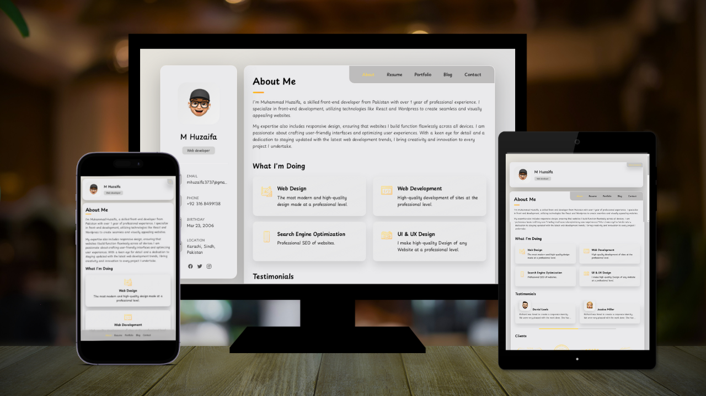

# MH - Personal portfolio

MH - Personal Portfolio Website is a front-end project developed by Muhammad Huzaifa. It is designed to serve as a personal portfolio website showcasing your skills, projects and testimonials. This documentation will provide an overview of the project's functionality and how to use it.


## Project Structure

index.html: The main HTML file containing the structure of the portfolio website.
The project is divided into the following directories:
* **Assets** - Contains the project's assets such as images, fonts, and other files.

## Demo



## Functionality 

The JavaScript code in the project provides the following functionality:

Toggle the sidebar for mobile devices.
Display testimonials in a modal when clicked.
Filter and display items based on the category selected in the custom select.
Enable the contact form's submit button when input fields are valid.
Switch between portfolio sections using the navigation links.


## Prerequisites

Before you begin, ensure you have met the following requirements:

* [Git](https://git-scm.com/downloads "Download Git") must be installed on your operating system.

## Installing MH - Personal portfolio

To install **MH - Personal portfolio**, follow these steps:

Linux and macOS:

```bash
sudo git clone https://github.com/Huzaifa3737/MH-Personal-portfolio.git
```

Windows:

```bash
git clone https://github.com/Huzaifa3737/MH-Personal-portfolio.git
```

## LICENSE 

MIT
